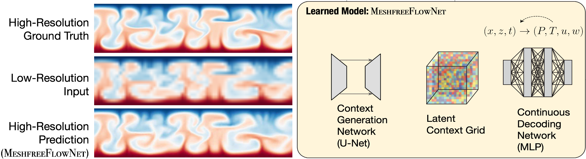

# MeshfreeFlowNet

By: [Chiyu "Max" Jiang*](http://maxjiang.ml/), [Soheil Esmaeilzadeh*](https://soheilesm.github.io/), [Kamyar Azizzadenesheli](https://www.cs.purdue.edu/homes/kamyar/), [Karthik Kashinath](http://www.nersc.gov/about/nersc-staff/data-analytics-services/karthik-kashinath/), [Mustafa Mustafa](https://www.nersc.gov/about/nersc-staff/data-analytics-services/mustafa-mustafa/), [Hamdi Tchelepi](https://profiles.stanford.edu/hamdi-tchelepi), [Philip Marcus](http://www.me.berkeley.edu/people/faculty/philip-s-marcus), [Prabhat](http://www.nersc.gov/about/nersc-staff/data-analytics-services/prabhat/), [Anima Anandkumar](http://tensorlab.cms.caltech.edu/users/anima/) (* Denotes Equal Contributions)

\[[Project Website](http://www.maxjiang.ml/proj/meshfreeflownet)\] \[[Paper](to_appear)\] \[[Video](https://youtu.be/mjqwPch9gDo)\]
 

This is the code repository for the MeshfreeFlowNet: physical constrained space time super-resolution. Code implemented in PyTorch.

## Introduction
MeshfreeFlowNet is a novel deep learning-based super-resolution framework to generate continuous (grid-free) spatio-temporal solutions from the low-resolution inputs. While being computationally efficient, MeshfreeFlowNet accurately recovers the fine-scale quantities of interest. MeshfreeFlowNet allows for: (i) the output to be sampled at all spatio-temporal resolutions, (ii) a set of Partial Differential Equation (PDE) constraints to be imposed, and (iii) training on fixed-size inputs on arbitrarily sized spatio-temporal domains owing to its fully convolutional encoder.

## Repo highlights
Here are a few reasons why you might be interested in using our code:
* We provide a general PyTorch-ready PDE layer that (i) allows evaluation of arbitrary combinations of partial differential equations (ii) provides a user-friendly interface that parses equations from human-readable string. (iii) computes gradient through any black-box function written using pytorch. Easy to plug-and-play into any physics informed ML projects. Find documentation and examples under [`src/`](src).
* We provide general layers for 3D U-Nets, continuous decoding network (using IM-NET backbone), and the interpolation layer.
* We provide scripts to reproduce the results in our paper.
