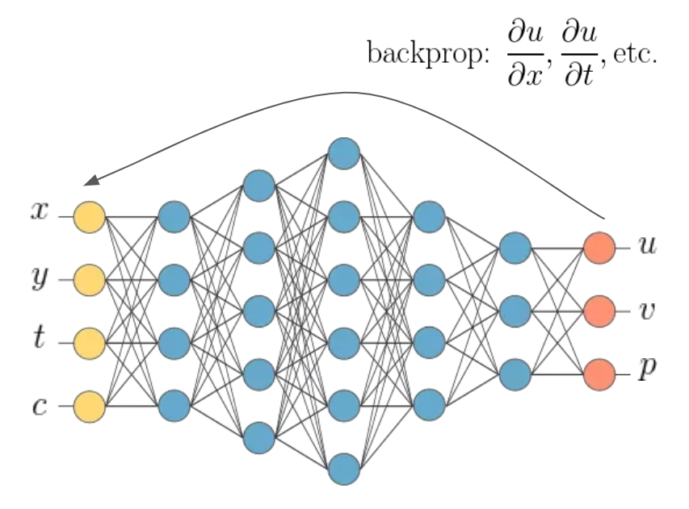
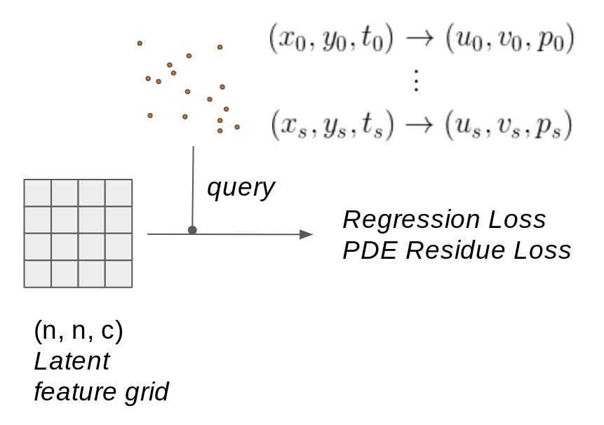

## Source codes for the space time pde modules
This page will provide some overview and examples for the functions and methods therein. More detailed API can be found under each function and class.

### Enforcing PDE constraints w/ Backprop


We implement a PDE layer for computing the residues of PDEs via backpropagation through the computation graph. For an arbitrary blackbox function ) that is implemented via PyTorch, our module allows aribtrary number of any partial differential equations that combines derivatives of any output variable with respect to any input variable. See below for an example.

#### Problem Statement
Suppose the PDE that we want to enforce is the following:


#### Problem Breakdown
Now we need to do three things in order to use the pde layer to compute the residues.
1. Identify the input variables and output variables. In this case, the input variables are ) and the output variables are )
2. Construct a lambda function that takes a vectorized form of the input variables and returns a vectorized form of the output variables. For instance,
```python
def fwd_function(X):
  """The forward function.
  
  Args:
    X: Input tensor of shape (..., n_input), where the last dimension must correspond to the number of 
    input variables. The leading dimensions could be arbitrary batch dimensions.
  Returns:
    Y: Output tensor of shape (..., n_output), where the last dimension must correspond to the number of 
    output variables. The leading dimensions must match that of the input tensor X.
  """
  # Implement the function. Usually this is a learnable mapping, and an easy example would simply be to 
  # use a multilayer perceptron of n_input input nodes and n_output output nodes.
  return Y
```
3. Express the partial differential equations in the form of text. Since we are enforcing the equations with residue losses, we need to move the terms to the same side of the equal sign to be expressed as a residue term. Since the absolute value of the residue will be used, the sign of the residue at the moment does not matter. In this example, we have:
 ```python
 eqn_str_1 = 'dif(u, t) - (dif(dif(u, x), x) + dif(dif(u, y), y))'
 eqn_str_2 = 'dif(v, t) - (dif(dif(v, x), x) + dif(dif(v, y), y))'
 ```

There is no particular rule as to how the equations should be written. The parser is rather flexible, as long as it is a valid expression. The only thing to note is that the derivative operator should be written in the form of `dif(u, x)` to express a differential operator .

#### Implementation
See below for an example of how to setup the PDE layer for the equations above.

```python
import torch
import numpy as np
from pde import PDELayer

########### set up the variables and equations ###########
in_vars = 'x, y, t'
out_vars = 'u, v'
eqn_strs = ['dif(u, t) - (dif(dif(u, x), x) + dif(dif(u, y), y))',
            'dif(v, t) - (dif(dif(v, x), x) + dif(dif(v, y), y))']
eqn_names = ['diffusion_u', 'diffusion_v']   # a name/identifier for the equations

# define the forward function. In this example we use an analytical function instead of a
# neural network so that we can check the gradients and residues by hand.
def fwd_fn(inpt):
  """Arbitrary forward function.

  Where inpt[..., 0], inpt[..., 1], inpt[..., 2] correspond to x, y, t and 
  out[..., 0], out[..., 1] correspond to u, v
  """
  u = inpt[..., 0:1]**2 + 3*inpt[..., 1:2]**2*inpt[..., 2:3] + inpt[..., 0:1]*inpt[..., 2:3]
  v = inpt[..., 0:1]**2 + 3*inpt[..., 1:2]**2*inpt[..., 2:3] + inpt[..., 0:1]*inpt[..., 2:3]
  return torch.cat([u, v], axis=-1)

########### demo inputs and outputs to check results ###########
# input tensor
inpt = torch.tensor([[1., 2., 3.]])
x, y, t = inpt[..., 0:1], inpt[..., 1:2], inpt[..., 2:3]
g = x + 3*y**2 - 2 - 6*t  # analytically computed ground truth gradient for checking.
expected_grads = {eqn_names[0]: g, eqn_names[1]: g}  # expected gradients
expected_val = fwd_fn(inpt)  # expected forward pass value

########### initializing and querying the PDE layer ###########
pdel = pde.PDELayer(in_vars=in_vars, out_vars=out_vars)  # initialize the pde layer

for eqn_str, eqn_name in zip(eqn_strs, eqn_names):  # add arbitrary number of equations
    pdel.add_equation(eqn_str, eqn_name)
pdel.update_forward_method(fwd_fn)  # update the lambda function for computing forward pass

val, res = pdel(inpt)  # val are the forward pass values, res are the equation residues

# test that forward pass values are correct
np.testing.assert_allclose(val.detach().numpy(), expected_val.detach().numpy(), atol=1e-4)

# test that the pde residues computed by the layer matches analytically computed residues.
for eqn_name in eqn_names:
    np.testing.assert_allclose(res[eqn_name].detach().numpy(),
                               expected_res[eqn_name].detach().numpy())
```

### Local Implicit Grid Layer


The local implicit grid layer is a layer that allows querying the latent feature grid at arbitrary locations and returns the forward values at those locations. The forward values are computed by locally querying a neural network and uses multi-linear interpolation on the 2^d queries. The layer is implemented in a dimensionally agnostic manner and works for arbitrary dimensions (e.g., 1-d, 2-d, 3-d, 4-d for space + time). This layer computes the forward pass for the function values at the queried positions. It can be used as a forward method in the `PDELayer` in order to compute the PDE residue losses at the same positions. See complete example below. The same example can also be found in the integration test [`local_implicit_grid_integration_test.py`](local_implicit_grid_integration_test.py).

```python
import numpy as np
import torch
from local_implicit_grid import query_local_implicit_grid
from implicit_net import ImNet
from pde import PDELayer


# setup parameters
batch_size = 8  # batch size
grid_res = 16  # grid resolution
nc = 32  # number of latent channels
dim_in = 3
dim_out = 2
n_filter = 16  # number of filters in neural net
n_pts = 1024  # number of query points

# setup pde constraints
in_vars = 'x, y, t'  # matches dim_in
out_vars = 'u, v'    # matches dim_out
eqn_strs = ['dif(u, t) - (dif(dif(u, x), x) + dif(dif(u, y), y))',
            'dif(v, t) - (dif(dif(v, x), x) + dif(dif(v, y), y))']
eqn_names = ['diffusion_u', 'diffusion_v']

# setup local implicit grid as forward function
latent_grid = torch.rand(batch_size, grid_res, grid_res, grid_res, nc)
query_pts = torch.rand(batch_size, n_pts, dim_in)
model = ImNet(dim=dim_in, in_features=nc, out_features=dim_out, nf=n_filter)
fwd_fn = lambda query_pts: query_local_implicit_grid(model, latent_grid, query_pts, 0., 1.)

# setup pde layer
pdel = PDELayer(in_vars=in_vars, out_vars=out_vars)
for eqn_str, eqn_name in zip(eqn_strs, eqn_names):
    pdel.add_equation(eqn_str, eqn_name)
pdel.update_forward_method(fwd_fn)
val, res = pdel(query_pts)

# it's harder to check values due to the randomness of the neural net. so we test shape
# instead
np.testing.assert_allclose(val.shape, [batch_size, n_pts, dim_out])
for key in res.keys():
    res_value = res[key]
    np.testing.assert_allclose(res_value.shape, [batch_size, n_pts, 1])
```
